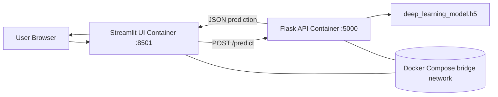

# Task 11 Architecture

## Execution flow
1. User opens the Streamlit UI.
2. User uploads a handwritten digit image.
3. Streamlit sends the image to the Flask service.
4. Flask preprocesses the image and runs the CNN.
5. The trained model produces class probabilities.
6. Flask returns JSON containing the predicted digit and confidence.
7. Streamlit displays the prediction and probability chart.